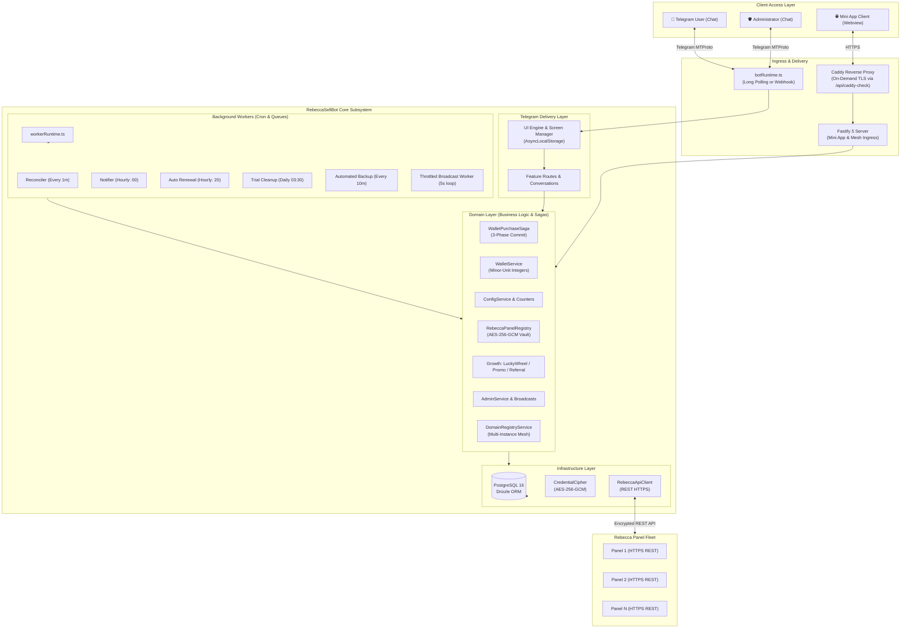

# RebeccaSellBot — Complete System Architecture

RebeccaSellBot is an enterprise-grade, multi-panel Telegram commerce and subscription management system designed for **Rebecca Panel** VPN infrastructures. It operates as an autonomous storefront handling customer onboarding, package selection, automated payment verification, configuration provisioning, renewals, notifications, balance transfers, gamification, and backoffice administration.

---

## 1. System Overview & Core Principles



### Invariant Architectural Rules

1. **Zero Database Touch on Rebecca Panels:** RebeccaSellBot communicates with external Rebecca panels exclusively through their official HTTPS REST APIs (`RebeccaApiClient`). It never connects directly to or mutates remote panel databases.
2. **Dual-Mode Delivery Architecture (Long Polling & Webhook):** The bot operates by default with outbound HTTPS long polling (`bot.start()`), requiring zero inbound ports or public domains. For deployments behind reverse proxies, an optional Webhook mode (`webhookCallback()`) can be enabled with strict `X-Telegram-Bot-Api-Secret-Token` validation. Returning to polling automatically clears active webhooks.
3. **Layered Separation of Concerns:**
   - Presentation files (`src/telegram/*`) are strictly decoupled from database queries; all state changes flow through typed domain services.
   - Domain services (`src/domain/services/*`) encapsulate business rules, financial invariants, and sagas.
   - Infrastructure (`src/infra/*`) manages PostgreSQL access via Drizzle ORM, encryption ciphers, and HTTP client execution.
4. **Static Architecture Enforcement:** Structural boundaries and anti-patterns are statically verified by [`scripts/check-architecture.mjs`](../scripts/check-architecture.mjs) on every build and CI run.

---

## 2. Financial Architecture & Purchase Saga

To prevent balance discrepancies, orphaned purchases, and race conditions during network partitions, RebeccaSellBot uses strict transactional isolation and integer accounting.

### Integer Minor-Unit Arithmetic (`DbNumber.ts`)

All financial quantities (wallet balances, package prices, discounts, referral bonuses, transaction amounts) are stored and computed as **signed 64-bit integers in minor currency units (e.g. Tomans or Rials)**. Floating-point arithmetic is strictly forbidden across the codebase to prevent rounding drift.

```text
┌────────────────────────────────────────────────────────┐
│               Safe Integer Bounds                      │
│   Min: -9,007,199,254,740,991                          │
│   Max:  9,007,199,254,740,991                          │
│   Constraint: user.balance >= 0 (Enforced by DB Check) │
└────────────────────────────────────────────────────────┘
```

### 3-Phase Purchase Saga (`WalletPurchaseSaga.ts`)

Purchasing a VPN configuration involves both local PostgreSQL state mutations and external panel network calls. The 3-phase saga guarantees eventual consistency:

```text
Telegram User Checkout
         │
         ▼
┌────────────────────────────────┐
│  Phase 1: Fund Reservation     │ ──► Atomically deduct balance & create pending purchase
└────────────────┬───────────────┘
                 │
                 ▼
┌────────────────────────────────┐
│  Phase 2: External Dispatch    │ ──► Call remote Rebecca REST API (Create / Renew User)
└────────────────┬───────────────┘
                 │
        ┌────────┴────────┐
        │                 │
     Success           Failure / Timeout
        │                 │
        ▼                 ▼
┌──────────────────┐  ┌──────────────────┐
│ Phase 3a: Commit │  │ Phase 3b: Settle │
│ - Confirm Config │  │ - Refund Reserve │
│ - Award Referral │  │ - Rollback State │
│ - Clear Checkout │  │ - Audit Failure  │
└──────────────────┘  └──────────────────┘
```

1. **Phase 1 (Reserve):** Checks balance sufficiency and atomically moves funds from the user's available balance into a reserved ledger row within a PostgreSQL transaction.
2. **Phase 2 (Remote Dispatch):** Sends the provision/renew request to the target Rebecca Panel via `RebeccaService`.
3. **Phase 3a (Commit on Success):** Registers the remote subscription details locally, records an immutable purchase statement, awards referral cashback/bonuses, and delivers the config/QR code.
4. **Phase 3b (Compensation on Failure):** If the external panel is unreachable or rejects the payload, the reserved funds are automatically refunded to the user's wallet with an audit reason logged.

---

## 3. Multi-Panel Fleet Orchestration

RebeccaSellBot can manage single or multiple independent Rebecca panels across different regions and clusters.

```text
┌───────────────────────────────────────────────────────────┐
│                 RebeccaPanelRegistry                      │
└─────────────────────────────┬─────────────────────────────┘
                              │ Resolves panel by ID
         ┌────────────────────┼────────────────────┐
         ▼                    ▼                    ▼
┌─────────────────┐  ┌─────────────────┐  ┌─────────────────┐
│ German Cluster  │  │ Finnish Cluster │  │ Iranian Gateway │
│ Panel ID: de-01 │  │ Panel ID: fi-01 │  │ Panel ID: ir-01 │
│ HTTPS REST API  │  │ HTTPS REST API  │  │ HTTPS REST API  │
└─────────────────┘  └─────────────────┘  └─────────────────┘
```

### Encrypted Credential Vault (`CredentialCipher.ts`)

- Panel API keys, admin usernames, and passwords stored in PostgreSQL are encrypted at rest using **AES-256-GCM** with random 12-byte initialization vectors (IVs) and PBKDF2 key derivation.
- Plaintext credentials exist in memory only for the microsecond duration of an outgoing HTTP request.

### Dynamic Package-to-Panel Binding

- Packages can be assigned to specific panels or panel categories (`PackageCategoryService`).
- Administrators can seamlessly activate, deactivate, or migrate panel allocations from the Telegram `/admin` interface.

---

## 4. Telegram Mini App & Multi-Instance Mesh Architecture

RebeccaSellBot includes a modern Fastify 5 server and React 19 Telegram Mini App dashboard.

```text
               Public HTTPS Traffic (*.yourdomain.com)
                                 │
                                 ▼
                    ┌────────────────────────┐
                    │      Caddy Ingress     │
                    │   (On-Demand TLS Ask)  │
                    └───────────┬────────────┘
                                │ ask http://main_bot:3002/api/caddy-check
                                ▼
                    ┌────────────────────────┐
                    │   main_bot (Port 3002) │
                    │  Shared Mesh Registry  │
                    └───────────┬────────────┘
                                │
         ┌──────────────────────┼──────────────────────┐
         ▼                      ▼                      ▼
┌──────────────────┐  ┌──────────────────┐  ┌──────────────────┐
│ Instance "main"  │  │ Instance "vip"   │  │ Instance "shop3" │
│ Local Fastify    │  │ Proxy over mesh  │  │ Proxy over mesh  │
└──────────────────┘  └──────────────────┘  └──────────────────┘
```

### Fastify WebApp Backend (`src/webapp/server/`)

1. **Authentication & Security:**
   - **Telegram Client Auth:** Validates the cryptographic HMAC-SHA256 signature of Telegram's `initData` against the `BOT_TOKEN`.
   - **Admin Session:** Issues HTTP-only, secure JWT cookies signed with `ADMIN_SESSION_SECRET` (or a bot-token-derived fallback).
   - **Rate Limiting & CORS:** Enforces 100 requests/minute per IP and restricts CORS origins to authorized frontend origins.

2. **On-Demand TLS Verification (`/api/caddy-check`):**
   - Responds to Caddy's `ask` endpoint (`GET /api/caddy-check?domain=<host>`).
   - Dynamically authorizes SSL certificate issuance for any domain registered to this instance or peer instances in the shared registry.

3. **Multi-Instance Mesh Dispatcher (`DomainRegistryService`):**
   - Each instance records its public domain, target URL, and host port in a shared Docker volume (`rsbot_registry`, `/app/data/registry/`).
   - When Caddy routes wildcard traffic to the primary container (`main_bot`), Fastify checks the incoming `Host` header.
   - If the request targets a peer instance, it transparently streams the HTTP request to the peer over the internal `rsbot_mesh` Docker network, guarding against loops via `x-rsbot-proxy-hops`.

### React 19 Frontend (`webapp/src/`)

- Built with **React 19**, **Tailwind CSS v4**, **DaisyUI v5**, and **TanStack React Query**.
- **User Portal:** Real-time quota gauges, expiry counters, QR codes, sub links, and balance history.
- **Admin Dashboard:** Overview metrics, user CRM, receipt verification, panel fleet status, and service modules.

---

## 5. Background Workers & Job Scheduler

Background automation is orchestrated by `src/jobs/workerRuntime.ts` using cron schedules and persistent locking:

```text
┌────────────────────────────────────────────────────────────────────────┐
│                        workerRuntime.ts                                │
└───────┬──────────────┬──────────────┬──────────────┬─────────────┬─────┘
        │              │              │              │             │
        ▼              ▼              ▼              ▼             ▼
  ┌──────────┐   ┌──────────┐   ┌──────────┐   ┌──────────┐  ┌──────────┐
  │Reconciler│   │ Notifier │   │Auto-Renew│   │TrialPurge│  │Broadcast │
  │(Every 1m)│   │ (Hourly) │   │ (Min 20) │   │  (03:30) │  │ (5s loop)│
  └──────────┘   └──────────┘   └──────────┘   └──────────┘  └──────────┘
```

| Worker             | Schedule       | Purpose                                                                                                                    |
| :----------------- | :------------- | :------------------------------------------------------------------------------------------------------------------------- |
| **`reconciler`**   | Every 1 minute | Settles pending purchase intents (>5m old), synchronizes subscription statuses, and scans orphaned configs (15m interval). |
| **`notifier`**     | `0 * * * *`    | Hourly sweep detecting low traffic (<1 GB) or near expiry (<3 days) with durable 24h deduplication.                        |
| **`autoRenewal`**  | `20 * * * *`   | Evaluates active subscriptions with auto-renewal enabled; executes wallet-backed purchase sagas.                           |
| **`trialCleanup`** | `30 3 * * *`   | Daily sweep (03:30 UTC) permanently purging expired trial accounts past their 3-day grace period.                          |
| **`backup`**       | `*/10 * * * *` | Every 10 minutes checks if the configured database backup interval has elapsed and dispatches snapshots.                   |
| **`broadcast`**    | 5-second loop  | Claims batches of 15 recipients (concurrency 3), honors Telegram rate limits, and supports live cancel.                    |

---

## 6. Telegram Delivery Layer & UI Engine

Detailed delivery layer specifications are documented in [docs/telegram-architecture.md](telegram-architecture.md).

### Message Role State Machine

| Role               | Description                                                                        | Lifecycle Policy                                                                              |
| :----------------- | :--------------------------------------------------------------------------------- | :-------------------------------------------------------------------------------------------- |
| **`screen`**       | Main interactive views (dashboards, menus, catalogs).                              | Updated in-place via `editMessageText` (`renderUiScreen`). Replaced on major view navigation. |
| **`prompt`**       | Intermediate conversational requests (e.g. "Enter transfer amount").               | Cleaned up automatically upon conversation completion or cancellation.                        |
| **`artifact`**     | High-value outputs (VPN subscription links, QR codes, receipts, transaction info). | **Protected & Permanent:** Never overwritten or deleted during menu navigation.               |
| **`notification`** | Automated alerts (low quota warnings, renewal confirmations).                      | Durable messages tracked independently from interactive screens.                              |

### Inbound Rebecca Panel Webhooks (`RebeccaWebhookService.ts`)

In addition to outbound REST calls to Rebecca panels, RebeccaSellBot receives real-time webhook push events:

- **Authentication:** Validated via constant-time comparison (`crypto.timingSafeEqual`) on the `x-webhook-secret` header against `REBECCA_WEBHOOK_SECRET`.
- **Supported Events:** `user_limited`, `user_expired`, `user_disabled`, `user_enabled`, `user_deleted`.
- **User Alerts:** Pushes instant notifications with a 1-tap renewal button (`sub:detail:<id>`) directly into the user's chat.

---

## 7. Gamification & Growth Engine

- **Lucky Wheel (`LuckyWheelService.ts`):** Configurable lottery wheel with weighted prize tables, daily free spin cooldowns, win caps, and instant wallet balance deposits.
- **Referral & Cashback (`ReferralService.ts`):** Tracks inviter-invitee trees, automatically awarding percentage or fixed cashback on successful purchases.
- **Promo Codes (`PromoService.ts`):** Supports single-use and multi-use discount vouchers with expiration dates, maximum redemption ceilings, and package-specific scopes.

---

## 8. Database Architecture & Schema Integrity

Data persistence is managed via **PostgreSQL 16** with **Drizzle ORM** (`src/infra/schema.ts`):

```text
┌──────────────┐       1:N       ┌─────────────────────┐       1:N       ┌─────────────────────┐
│    users     │ ─────────────── │    user_configs     │ ─────────────── │   config_history    │
└──────┬───────┘                 └──────────┬──────────┘                 └─────────────────────┘
       │ 1:N                                │ N:1
       ├─────────────────┐                  ▼
       │                 │         ┌─────────────────────┐
       ▼                 ▼         │   rebecca_panels    │
┌──────────────┐  ┌──────────────┐ └─────────────────────┘
│ wallet_trans │  │ topup_receipt│
└──────────────┘  └──────────────┘
```

### Data Integrity Safeguards

- **Transactional Consistency:** Critical balance changes, checkouts, and receipt verifications run in isolated database transactions.
- **Check Constraints:** PostgreSQL enforces `balance >= 0`, valid status enumerations (`active`, `limited`, `expired`, `revoked`, `deleted`), and minor-unit bounds.
- **Unique Indexes:** Protect against duplicate receipt submissions, concurrent checkout collisions, and duplicate referral claims.

---

## 9. Deployment & Multi-Instance Operations

For deployment instructions, reverse proxy configurations, and CLI reference, see [docs/deployment.md](deployment.md).
For environment variable reference, see [docs/configuration.md](configuration.md).
