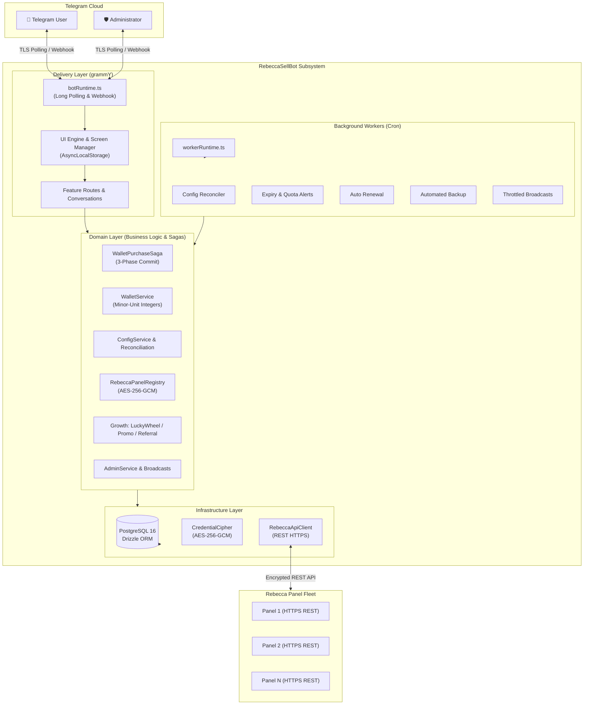

# RebeccaSellBot — Complete System Architecture

RebeccaSellBot is an enterprise-grade, multi-panel Telegram commerce and subscription management system designed for **Rebecca Panel** VPN infrastructures. It operates as an autonomous storefront handling customer onboarding, package selection, automated payment verification, configuration provisioning, renewals, notifications, balance transfers, gamification, and backoffice administration.

---

## 1. System Overview & Core Principles



### Invariant Architectural Rules

1. **Zero Database Touch on Rebecca Panels:** RebeccaSellBot communicates with external Rebecca panels exclusively through their official HTTPS REST APIs (`RebeccaApiClient`). It never connects directly to or mutates remote panel databases.
2. **Dual-Mode Delivery Architecture (Long Polling & Webhook):** The bot operates by default with outbound HTTPS long polling (`bot.start()`), requiring zero inbound ports or public domains. For deployments behind reverse proxies or hosted within **Rebecca Panel External Apps**, an optional Webhook mode (`webhookCallback()`) can be enabled with strict `X-Telegram-Bot-Api-Secret-Token` validation. Returning to polling automatically clears active webhooks.
3. **Layered Separation of Concerns:**
   - Presentation files (`src/telegram/*`) are strictly decoupled from database queries; all state changes flow through typed domain services.
   - Domain services (`src/domain/services/*`) encapsulate business rules, financial invariants, and sagas.
   - Infrastructure (`src/infra/*`) manages PostgreSQL access via Drizzle ORM, encryption ciphers, and HTTP client execution.
4. **Static Architecture Enforcement:** Structural boundaries and anti-patterns are statically verified by [`scripts/check-architecture.mjs`](../scripts/check-architecture.mjs) on every build and CI run.

---

## 2. Financial Architecture & Purchase Saga

To prevent balance discrepancies, orphaned purchases, and race conditions during network partitions, RebeccaSellBot uses strict transactional isolation and integer accounting.

### Integer Minor-Unit Arithmetic (`DbNumber.ts`)

All financial quantities (wallet balances, package prices, discounts, referral bonuses, transaction amounts) are stored and computed as **signed 64-bit integers in minor currency units (e.g. Tomans or Rials)**. Floating-point arithmetic is strictly forbidden across the codebase to prevent rounding drift.

```text
┌────────────────────────────────────────────────────────┐
│               Safe Integer Bounds                      │
│   Min: -9,007,199,254,740,991                          │
│   Max:  9,007,199,254,740,991                          │
│   Constraint: user.balance >= 0 (Enforced by DB Check) │
└────────────────────────────────────────────────────────┘
```

### 3-Phase Purchase Saga (`WalletPurchaseSaga.ts`)

Purchasing a VPN configuration involves both local PostgreSQL state mutations and external panel network calls. The 3-phase saga guarantees eventual consistency:

```text
Telegram User Checkout
         │
         ▼
┌────────────────────────────────┐
│  Phase 1: Fund Reservation     │ ──► Atomically deduct balance & create pending purchase
└────────────────┬───────────────┘
                 │
                 ▼
┌────────────────────────────────┐
│  Phase 2: External Dispatch    │ ──► Call remote Rebecca REST API (Create / Renew User)
└────────────────┬───────────────┘
                 │
        ┌────────┴────────┐
        │                 │
     Success           Failure / Timeout
        │                 │
        ▼                 ▼
┌──────────────────┐  ┌──────────────────┐
│ Phase 3a: Commit │  │ Phase 3b: Settle │
│ - Confirm Config │  │ - Refund Reserve │
│ - Award Referral │  │ - Rollback State │
│ - Clear Checkout │  │ - Audit Failure  │
└──────────────────┘  └──────────────────┘
```

1. **Phase 1 (Reserve):** Checks balance sufficiency and atomically moves funds from the user's available balance into a reserved ledger row within a PostgreSQL transaction.
2. **Phase 2 (Remote Dispatch):** Sends the provision/renew request to the target Rebecca Panel via `RebeccaService`.
3. **Phase 3a (Commit on Success):** Registers the remote subscription details locally, records an immutable purchase statement, awards referral cashback/bonuses, and delivers the config/QR code.
4. **Phase 3b (Compensation on Failure):** If the external panel is unreachable or rejects the payload, the reserved funds are automatically refunded to the user's wallet with an audit reason logged.

---

## 3. Multi-Panel Fleet Orchestration

RebeccaSellBot can manage single or multiple independent Rebecca panels across different regions and clusters.

```text
┌───────────────────────────────────────────────────────────┐
│                 RebeccaPanelRegistry                      │
└─────────────────────────────┬─────────────────────────────┘
                              │ Resolves panel by ID
         ┌────────────────────┼────────────────────┐
         ▼                    ▼                    ▼
┌─────────────────┐  ┌─────────────────┐  ┌─────────────────┐
│ German Cluster  │  │ Finnish Cluster │  │ Iranian Gateway │
│ Panel ID: de-01 │  │ Panel ID: fi-01 │  │ Panel ID: ir-01 │
│ HTTPS REST API  │  │ HTTPS REST API  │  │ HTTPS REST API  │
└─────────────────┘  └─────────────────┘  └─────────────────┘
```

### Encrypted Credential Vault (`CredentialCipher.ts`)

- Panel API keys, admin usernames, and passwords stored in PostgreSQL are encrypted at rest using **AES-256-GCM** with random 12-byte initialization vectors (IVs) and PBKDF2 key derivation.
- Plaintext credentials exist in memory only for the microsecond duration of an outgoing HTTP request.

### Dynamic Package-to-Panel Binding

- Packages can be assigned to specific panels or panel categories (`PackageCategoryService`).
- Administrators can seamlessly activate, deactivate, or migrate panel allocations from the Telegram `/admin` interface.

---

## 4. Telegram Delivery Layer & UI Engine

Detailed delivery layer specifications are documented in [docs/telegram-architecture.md](telegram-architecture.md).

```text
Incoming Update
       │
       ▼
┌─────────────────────────────────────────────────────────────────┐
│ 1. API Transformers (Throttler, Safe Formatting, Message Track) │
│ 2. Security Middleware (Private Chat Gate, Admin Firewall, Ban) │
│ 3. UI Cleaner Middleware (Clean previous screens, keep artifacts)│
│ 4. Conversations Container (20+ Interactive Step Handlers)      │
│ 5. Feature Handlers (Shop, Wallet, Subs, Admin Backoffice)      │
└─────────────────────────────────────────────────────────────────┘
```

### Message Role State Machine

| Role               | Description                                                                        | Lifecycle Policy                                                                              |
| :----------------- | :--------------------------------------------------------------------------------- | :-------------------------------------------------------------------------------------------- |
| **`screen`**       | Main interactive views (dashboards, menus, catalogs).                              | Updated in-place via `editMessageText` (`renderUiScreen`). Replaced on major view navigation. |
| **`prompt`**       | Intermediate conversational requests (e.g. "Enter transfer amount").               | Cleaned up automatically upon conversation completion or cancellation.                        |
| **`artifact`**     | High-value outputs (VPN subscription links, QR codes, receipts, transaction info). | **Protected & Permanent:** Never overwritten or deleted during menu navigation.               |
| **`notification`** | Automated alerts (low quota warnings, renewal confirmations).                      | Durable messages tracked independently from interactive screens.                              |

### Resilient Callback Routing (`callbackData.ts`)

- Strictly validates the **64-byte Telegram Bot API payload limit** on construction.
- Compact encoded identifiers (e.g. `buy:confirm:<checkoutId>`, `config:view:<id>`, `set:edit:<key>`).
- Catch-all fallback handler acknowledges stale or expired callback buttons to eliminate infinite client spinners.

### Zero-Secret Replay Principle

`@grammyjs/conversations` records message steps into database sessions to support replay. To prevent unencrypted secrets from leaking into session stores, sensitive administrator inputs (e.g. Rebecca panel API keys) are routed through dedicated one-shot handlers (`bot.on('message:text')`), encrypted immediately with `CredentialCipher`, and deleted from Telegram chat history.

### Dual-Mode Delivery (Long Polling & Webhook)

RebeccaSellBot supports two mutually exclusive delivery modes configured via environment variables:

1. **Long Polling (`BOT_DELIVERY_MODE=polling`, default):**
   - Starts via `bot.start()`.
   - Clears any existing Telegram webhook via `bot.api.deleteWebhook({ drop_pending_updates: false })` before polling to prevent 409 conflict errors.
   - Ideal for standard installations, servers without domain names, or zero-maintenance deployments.

2. **Webhook (`BOT_DELIVERY_MODE=webhook`):**
   - Starts an internal HTTP server that listens on `WEBHOOK_PORT` (default: 3000) and `WEBHOOK_HOST` (default: `0.0.0.0`).
   - Delegates incoming updates to grammY's `webhookCallback(bot, 'http', { secretToken })`.
   - Enforces the `X-Telegram-Bot-Api-Secret-Token` header, immediately rejecting unauthorized probes with HTTP 401.
   - Automatically answers internal health probes (`/health`, `/healthz`, `/ready`, `/readyz`) with HTTP 200.
   - Dispatches `bot.api.setWebhook()` once the HTTP server is bound.
   - Gracefully closes connections on `SIGINT`/`SIGTERM` with socket drain timeouts.

#### Reverse Proxy Integration

When running in Webhook mode, terminate SSL and forward traffic via **Caddy** or **Nginx**:

**Caddyfile:**

```caddy
# Standalone domain
bot.example.com {
    reverse_proxy 127.0.0.1:3000
}

# Subpath on existing domain
example.com {
    handle /rsbot/* {
        reverse_proxy 127.0.0.1:3000
    }
}
```

**Nginx:**

```nginx
location /rsbot/ {
    proxy_pass http://127.0.0.1:3000;
    proxy_http_version 1.1;
    proxy_set_header Host $host;
    proxy_set_header X-Real-IP $remote_addr;
    proxy_set_header X-Forwarded-For $proxy_add_x_forwarded_for;
    proxy_set_header X-Forwarded-Proto $scheme;
}
```

#### Rebecca Panel External App Integration

Rebecca Panel (branch `dev`) features isolated Node.js application hosting under its `externalapps` subsystem:

- When hosted as an External App, Rebecca Panel assigns a dynamic port via `PORT=20xxx` and sets `HOST=127.0.0.1`.
- RebeccaSellBot automatically senses `PORT` as the default `WEBHOOK_PORT` if not explicitly overridden.
- Rebecca Panel manages systemd supervision, SSL certificate provisioning, and HTTP reverse proxy routing directly to the bot.

---

## 5. Gamification & Growth Engine

```text
┌─────────────────────────────────────────────────────────────────┐
│                     Growth & Loyalty Subsystem                  │
├───────────────────┬─────────────────────────┬───────────────────┤
│    Lucky Wheel    │     Referral Engine     │   Promo Codes     │
│  (LuckyWheelSvc)  │      (ReferralSvc)      │    (PromoSvc)     │
├───────────────────┼─────────────────────────┼───────────────────┤
│ • Daily spins     │ • Multi-tier commission │ • Fixed discount  │
│ • Weighted odds   │ • Purchase cashback %   │ • Percentage off  │
│ • Custom rewards  │ • Direct wallet credit  │ • Usage caps & TTL│
└───────────────────┴─────────────────────────┴───────────────────┘
```

- **Lucky Wheel (`LuckyWheelService.ts`):** Configurable lottery wheel with weighted prize tables, daily free spin cooldowns, win caps, and instant wallet balance deposits.
- **Referral & Cashback (`ReferralService.ts`):** Tracks inviter-invitee trees, automatically awarding percentage or fixed cashback on successful purchases.
- **Promo Codes (`PromoService.ts`):** Supports single-use and multi-use discount vouchers with expiration dates, maximum redemption ceilings, and package-specific scopes.

---

## 6. Background Workers & Job Scheduler

Background automation is orchestrated by `src/jobs/workerRuntime.ts` using cron schedules:

```text
┌────────────────────────────────────────────────────────────────────────┐
│                        workerRuntime.ts                                │
└───────┬──────────────┬──────────────┬──────────────┬─────────────┬─────┘
        │              │              │              │             │
        ▼              ▼              ▼              ▼             ▼
  ┌──────────┐   ┌──────────┐   ┌──────────┐   ┌──────────┐  ┌──────────┐
  │Reconciler│   │ Notifier │   │Auto-Renew│   │  Backup  │  │Broadcast │
  └──────────┘   └──────────┘   └──────────┘   └──────────┘  └──────────┘
```

| Worker             | Schedule       | Purpose                                                                                           |
| :----------------- | :------------- | :------------------------------------------------------------------------------------------------ |
| **`reconciler`**   | `*/10 * * * *` | Synchronizes active configuration states with remote Rebecca panels; marks deleted/expired items. |
| **`notifier`**     | `*/15 * * * *` | Scans approaching expiries (<3 days) and quota limits (<1 GB), dispatching user notifications.    |
| **`autoRenewal`**  | `0 */1 * * *`  | Evaluates subscriptions with auto-renewal enabled; executes wallet-backed purchase sagas.         |
| **`trialCleanup`** | `0 */6 * * *`  | Revokes and purges expired trial configurations from external panels.                             |
| **`backup`**       | Scheduled      | Generates full `.tar.gz` database and environment snapshots; sends alert to administrators.       |
| **`broadcast`**    | Event Queue    | Delivers bulk announcements with rate throttling, cancellation support, and live progress bars.   |

---

## 7. Database Architecture & Schema Integrity

Data persistence is managed via **PostgreSQL 16** with **Drizzle ORM** (`src/infra/schema.ts`):

```text
┌──────────────┐       1:N       ┌─────────────────────┐       1:N       ┌─────────────────────┐
│    users     │ ─────────────── │    configurations   │ ─────────────── │   config_history    │
└──────┬───────┘                 └──────────┬──────────┘                 └─────────────────────┘
       │ 1:N                                │ N:1
       ├─────────────────┐                  ▼
       │                 │         ┌─────────────────────┐
       ▼                 ▼         │   rebecca_panels    │
┌──────────────┐  ┌──────────────┐ └─────────────────────┘
│ transactions │  │ topup_receipt│
└──────────────┘  └──────────────┘
```

### Data Integrity Safeguards

- **Transactional Consistency:** Critical balance changes, checkouts, and receipt verifications run in isolated database transactions.
- **Check Constraints:** PostgreSQL enforces `balance >= 0`, valid status enumerations (`active`, `limited`, `expired`, `revoked`, `deleted`), and minor-unit bounds.
- **Unique Indexes:** Protect against duplicate receipt submissions, concurrent checkout collisions, and duplicate referral claims.

---

## 8. Deployment & Instance Management (`rsbot`)

RebeccaSellBot provides multi-instance isolation on a single host via the global CLI `/usr/local/bin/rsbot`:

```text
Server Host (Ubuntu 24.04 LTS)
 ├── /opt/RebeccaSellBot/main/   (Instance: main   -> db: rsbot_main_db)
 ├── /opt/RebeccaSellBot/vip/    (Instance: vip    -> db: rsbot_vip_db)
 └── /usr/local/bin/rsbot        (Unified multi-instance CLI)
```

### Full-Bundle Backup & Atomic Disaster Recovery

- **Backup (`rsbot <instance> backup`):** Generates an unprivileged `0600` `.tar.gz` containing the PostgreSQL custom dump, instance `.env`, `docker-compose.yml`, and build metadata.
- **Transactional Restore (`rsbot <instance> restore <bundle>`):**
  1. Validates bundle checksums, schema compatibility, and manifest permissions.
  2. Generates an automated pre-restore rollback snapshot (`pre_restore_*.tar.gz`).
  3. Executes database restoration in a single transaction.
  4. Runs pending Drizzle migrations.
  5. Verifies container health before finalizing `.env` swap; rolls back automatically if health probes fail.
